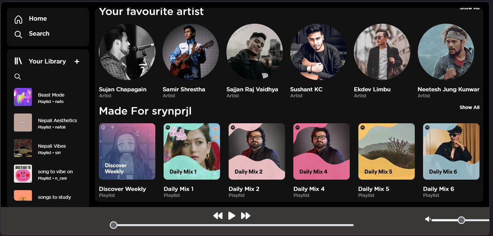

# Spotify Clone

A sleek, and functional frontend clone of the Spotify web player. This project was developed as a college project to showcase proficiency in web development technologies like HTML, CSS, and JavaScript.



## Features

- **Modern UI**: A pixel-perfect recreation of the Spotify interface (as of July 2024).
- **Music Player**: Fully functional audio player with controls for play/pause, next/previous, shuffle, and volume adjustment. (Audios not included in repository)
- Multiple Pages: Includes dedicated pages for:
  - Home / Dashboard
  - Search
  - Library / Playlists
  - Notifications
  - User Login
  - Settings

## Technologies Used
- HTML
- CSS
- JavaScript

## Project Structure

```text
├── assets/
│   ├── css/          # Stylesheets (style.css, media-query.css)
│   ├── fonts/        # Custom Gotham fonts
│   ├── img/          # UI icons, song covers, and playlist art
│   ├── js/           # Music player logic and UI scripts
│   └── screenshots/  # Project previews
├── index.html        # Main dashboard page
├── login.html        # User authentication UI
├── playlist.html     # Detailed playlist view
├── search.html       # Search interface
└── README.md         # Project documentation
```

## Getting Started

To run this project locally, simply clone the repository and open index.html in your favorite web browser.

1. Clone the repository:
   ```bash
   git clone https://github.com/srynprjl/spotify-clone.git
   ```
2. Navigate to the project directory:
   ```bash
   cd spotify-clone
   ```
3. Open the project:
   Double-click on index.html or use a local server like Live Server (VS Code extension).

## License

This project is for educational purposes only. All images, logos, and audio files are trademarks of their respective owners (Spotify, etc.).

---
